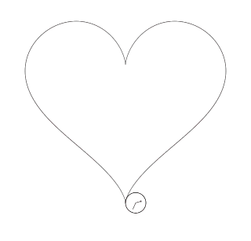
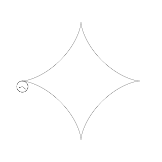
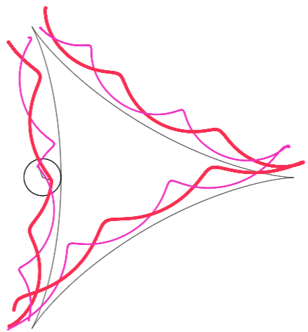
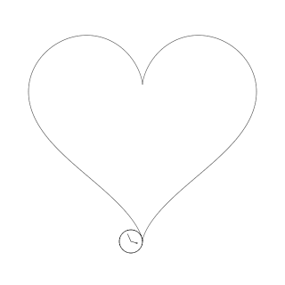

# Mechanism

## Assumption

The rolling circle doesn't have a collision box. It will keep rolling even if there's an overlapping region:

## Computation

Suppose there is a circle with radius r is rolling on the parametric equation defined by

### Calculation of the radians (angle) rotated:

Suppose this circle has its center located on B and it touches the parametric curve at A when t = t1. Point E lies on its circumference. B' corresponds to the center of the circle when t = t2 and point E'' corresponds to the position of point E after it has rotated θ radians.

The total length that this circle has rotated through, which is the length of the parametric curve between A and A' (the red curve in the above diagram), can be computed by the following definite integral (the arc length function)

And the rotation angle θ in radians therefore is

Since

The coordinates of that point on the circumference can be found:

### Position of the center of the circle

The gradient of the tangent at point A' where t = t2 can be found by parametric differentiation:

The gradient of the normal which passes through the center of the circle can then be found:

The coordinate of A' can be calculated by substituting t = t2 into the parametric equation

Knowing the gradient of A'B', the coordinate of B' can be obtained using the coordinate of A':

where sgn(n) is the sign of the gradient of the normal.

---

## Sign adjustment

By the above method of computation, the circle will always appear above the graph, which may cause weird "jumps" at the point where the gradient is undefined. Example:

This problem could be resolved to some extent by adjusting the sign of &Delta;x, which could be achieved automatically in my JavaScript drawer (not available in Geogebra implementation though). There are two ways to do this, but one is experimental.

## Common adjustment required

It is found that regardless of the sign-changing method used, sign needs to always be adjust at vertical tangent. The value of t is calculated using [Newton's method](https://en.wikipedia.org/wiki/Newton%27s_method). 

## 1. Auto sign-changing by switching sides

I keep the roulette continuous by changing both the sign of &Delta;x at vertical cusp and changing the rotation direction of the circle at all cusps:

The effect is shown in the following table.

| Heart | Astroid |
| ---- | ---- |
| |  |
| config is available [here](doc/heart.json) |config is available [here](doc/astroid.json) |

Currently there's no way to perfectly deal with parametric curve with three cusps because the roulette will always be broken at one cusp.

## 2. Revolving around cusps 

Some considered the first method to be unnatural as the roulette doesn't appear consistently inside or outside the parametric curve. Therefore, I came up with this method in order to correct that issue.

The roulette is kept consistently inside or outside the parametric curve by switching signs of &Delta;x at horizontal cusp rather than vertical cusp. The rotation direction of the circle is consistent throughout.

Additionally, when a vertical or horizontal cusp is met, the circle will revolve around the cusp. The drawback of this method is that the path of revolution and the previous roulette may appear to be not contiguous. This is mainly caused by inaccuracies in floating point arithmetic. The effect of this method is shown below, in comparison with the previous method.

| Heart | Astroid |
| ---- | ---- |
| |  |
| config is available [here](doc/heart-revolve.json) |config is available [here](doc/astroid-revolve.json) |

However, the direction of rotation and the sign (whether the half-circle at the cusp should point upward or downward) depend on the original rotation direction, dy/dt, dx/dt and (maybe) some other unknown factors. Up to now, I am unable to find an algorithm that can correctly generate the path of revolution around the cusp for ALL CASES, so you may found the direction of revolution incorrect for some parametric curves. Additionally, current method does not consider oblique cusps, which can be seen in a previous picture.

I will add buttons for you to manually adjust the path of revolution around cusps later.