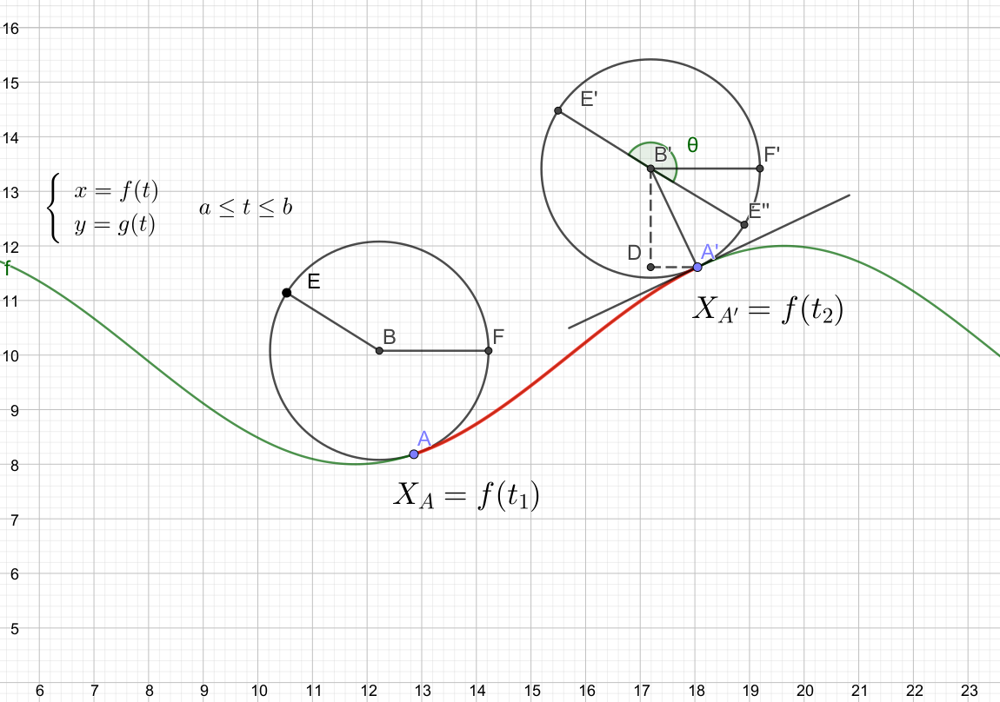
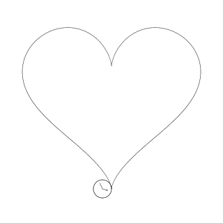

# Mechanism

## Assumption

The rolling circle doesn't have a collision box. It will keep rolling even if there's an overlapping region:

## Computation

Suppose there is a circle with radius r is rolling on the parametric equation defined by

### Calculation of the radians (angle) rotated:

Suppose this circle has its center located on  and it touches the parametric curve at A when . Point  lies on its circumference.  corresponds to the center of the circle when  and point E'' corresponds to the position of point  after it has rotated θ radians.

The total length that this circle has rotated through, which is the length of the parametric curve between  and  (the red curve in the above diagram), can be computed by the following definite integral (the arc length function)

And the rotation angle  in radians therefore is

Since

The coordinates of that point on the circumference can be found:

### Position of the center of the circle

The gradient of the tangent at point  where  can be found by parametric differentiation:

The gradient of the normal  which passes through the center of the circle can then be found:

The coordinate of A' can be calculated by substituting  into the parametric equation

Knowing the gradient of , the coordinate of  can be obtained using the coordinate of :

## Sign adjustment

By the above method of computation, the roulette will be broken at stationary points where the normal is vertical. For example,

 

This problem could be resolved to some extent by adjusting the sign of , which could be achieved automatically in my JavaScript drawer (not available in Geogebra implementation though). The sign adjustment methods are described below.

### Common adjustments required

It is found that regardless of the sign-changing method used, sign needs to always be adjusted at stationary points. At the point where the normal changes sign, the gradient must be either zero or infinity. We only want to adjust the sign the case where the gradient is zero. Hence, we should change the sign at  iff

where  is some small number,  and  are the gradient of the normal at  and , respectively. Additionally, , and for some any small , .

### 1. Auto sign-changing by switching sides

I keep the roulette continuous by changing both the sign of  at vertical cusp and changing the rotation direction of the circle at all cusps. Cusps are the points where the curvature is infinity. I record the sequence of increasing curvatures which are above 50 and pick and maximum (and assume it is the cusp). The (unsigned) curvature formula is shown below.

The effect is shown in the following table.

| Heart                                      | Astroid                                      |
| ------------------------------------------ | -------------------------------------------- |
|                   |                   |
| config is available [here](doc/configs/heart.json) | config is available [here](doc/configs/astroid.json) |

Currently, this method cannot perfectly deal with parametric curve with odd number of cusps, because the roulette will always be broken at one cusp.

### 2. Revolving around cusps 

Some considered the first method to be unnatural as the roulette doesn't appear consistently inside or outside the parametric curve. Therefore, I came up with this method in order to correct that issue.

The roulette is kept consistently inside or outside the parametric curve by switching signs of  at all cusps except horizontal cusps. The rotation direction of the circle is consistent throughout. Additionally, when a cusp is met, the circle will revolve around the cusp. The effect of this method is shown below.

| Heart                                              | Astroid                                              |
| -------------------------------------------------- | ---------------------------------------------------- |
|                   |                   |
| config is available [here](doc/configs/heart-revolve.json) | config is available [here](doc/configs/astroid-revolve.json) |

The drawback of this method is that the path of revolution and the previous roulette may appear to be not contiguous. This is mainly caused by inaccuracies in floating point arithmetic. Moreover, sometimes cusps may not be detected due to the numerical nature of my method. In such cases, try to decrease the drawing step so better numerical accuracy can be achieved.