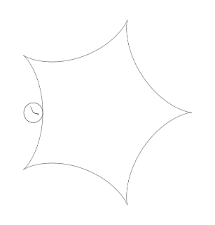
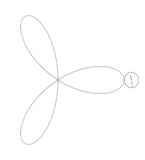

# Parametric Roulette

**Draw the locus of a point on a circle rolling on an arbitrary parametric function, implemented separately using Geogebra and JavaScript. To use the online drawer, please visit https://hanzhi713.github.io/Parametric-Roulette/index.html**.

## Mechanism

See [here](Mechanism.md)

### Example 1: Rolling on a hyperbola

| Equation                                                                                           | JS-generated GIF                            |
| -------------------------------------------------------------------------------------------------- | ------------------------------------------- |
|  |  |
| Config is available [here](doc/hyperbola.json)                                                     |

### Example 2: Rolling on the sine function

| Equation                                                                                         | JS-generated GIF         |
| ------------------------------------------------------------------------------------------------ | ------------------------ |
|  |  |
| Config is available [here](doc/sine.json)                                                        |

### Example 3: Rolling along an ellipse

| Equation                                                                                      | JS-generated GIF            |
| --------------------------------------------------------------------------------------------- | --------------------------- |
|  |  |
| Config is available [here](doc/ellipse.json)                                                  |

### and many others

| Heart                                     | Astroid                                     | Hypocycloid (k=4)                       | Rose (p=3)                                  |
| ----------------------------------------- | ------------------------------------------- | --------------------------------------- | ------------------------------------------- |
|        |        |  |          |
| [download config](doc/heart-revolve.json) | [download config](doc/astroid-revolve.json) | [download config](doc/five-cusps.json)  | [download config](doc/others/rose-3.json) |

## How to use

> Note: most settings have tooltips which explain their function. Hover your mouse over too see the tooltip.

1. On the right side, enter your parametric equation, , both as functions of . 
2. Enter the lower/upper limit of . 
3. Add some dots, manually or randomly generate
4. Hit "preview" and then "draw"
5. while not satisfied:
   1. Auto-adjust or manually change the scaling/translation (dx/dy/s) 
   2. Adjust the circle radius or use 👈 button to generate a radius
   3. Adjust the drawing step to gain more accuracy
   4. Tweak the dot parameters
   5. Change signs and rotation directions
   6. Change other settings
6. Finally, export your customized parametric roulette by clicking "save", "save to PNG" or "save to GIF" (on the dropdown)

Alternatively, you can start from a config given in any examples above and tweak settings. 

### What are "signs"?

Signs are a series of buttons for determining at which side of the curve the circle should appear. 🔄 is the button for resetting them and **R** is button to reverse all of them. Each time you change settings except for a few (like the parametric equation, t range, etc.), signs are preserved. If you find the curve is strange, please try to use 🔄 to reset signs and rotation directions. In most cases, the default-generated signs are optimal and you only need to use the **R** button rather than changing them individually.

## Implementation notes

Originally I planned to implement this using JavaScript as an extension and generalization to my "[Flowers-curve](https://github.com/hanzhi713/Flowers-Curve)" repository (which is about drawing the locus of a point on circle rolling along another circle). However, I was unable to find a JavaScript library that can evaluate the definite integral for the arc length function accurately and efficiently. Therefore, I initially made the prototype with Geogebra. The geogebra file could be found in the [doc](https://github.com/hanzhi713/Parametric-Roulette/tree/master/doc) folder.

Now, the JS drawer is successfully implemented as I found [Nerdamer](http://nerdamer.com) for symbolic differentiation and I used the trapezoidal rule for numerical integration. 

The interface of my JavaScript drawer is adapted from my [Spirograph drawer](https://github.com/hanzhi713/Flowers-Curve). New inputs are annotated by tooltips. It works best on Chrome and Firefox. Not tested on other browsers.