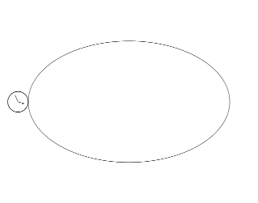

# Parametric Roulette

**Draw the locus of a point on a circle rolling on an arbitrary parametric function, implemented separately using Geogebra and JavaScript. To use the online drawer, please visit https://hanzhi713.github.io/Parametric-Roulette/index.html**.

## Mechanism

See [here](Mechanism.md)

## Example 1: Rolling on a hyperbola

| Equation                                                                                           | JS-generated GIF                            |
| -------------------------------------------------------------------------------------------------- | ------------------------------------------- |
|  |  |

Config is available [here](doc/hyperbola.json)

## Example 2: Rolling on the sine function

| Equation                                                                                         | JS-generated GIF         |
| ------------------------------------------------------------------------------------------------ | ------------------------ |
|  |  |
Config is available [here](doc/sine.json)

## Example 3: Rolling along an ellipse

| Equation                                                                                      | JS-generated GIF            |
| --------------------------------------------------------------------------------------------- | --------------------------- |
|  |  |

Config is available [here](doc/ellipse.json)

## Implementation notes

Originally I planned to implement this using JavaScript as an extension and generalization to my "[Flowers-curve](https://github.com/hanzhi713/Flowers-Curve)" repository (which is about drawing the locus of a point on circle rolling along another circle). However, I was unable to find a JavaScript library that can evaluate the definite integral for the arc length function accurately and efficiently. Therefore, I initially made the prototype with Geogebra. The geogebra file could be found in the [doc](https://github.com/hanzhi713/Parametric-Roulette/tree/master/doc) folder.

Now, the JS drawer is successfully implemented as I found [Nerdamer](http://nerdamer.com) for symbolic differentiation and I used the trapezoidal rule for numerical integration. 

The interface of my JavaScript drawer is adapted from my [Spirograph drawer](https://github.com/hanzhi713/Flowers-Curve). New inputs are annotated by tooltips. It works best on Chrome and Firefox. Not tested on other browsers.